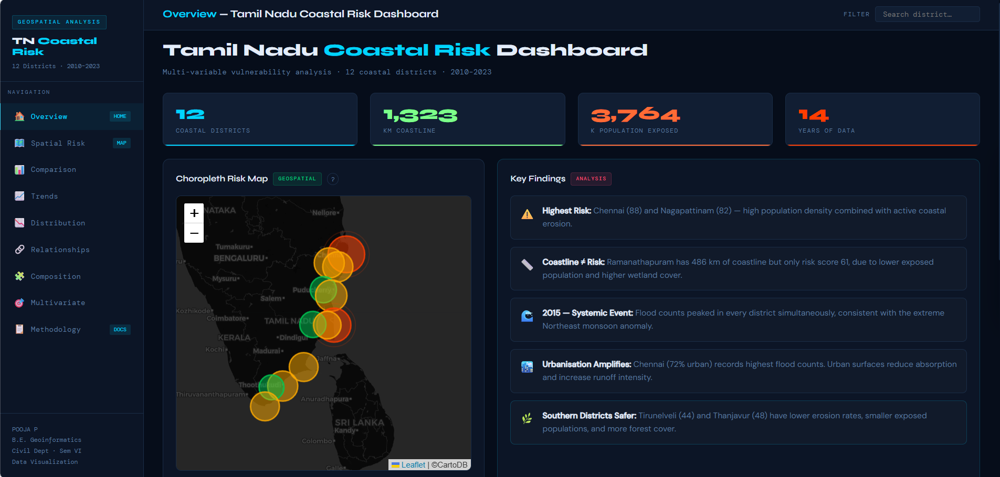
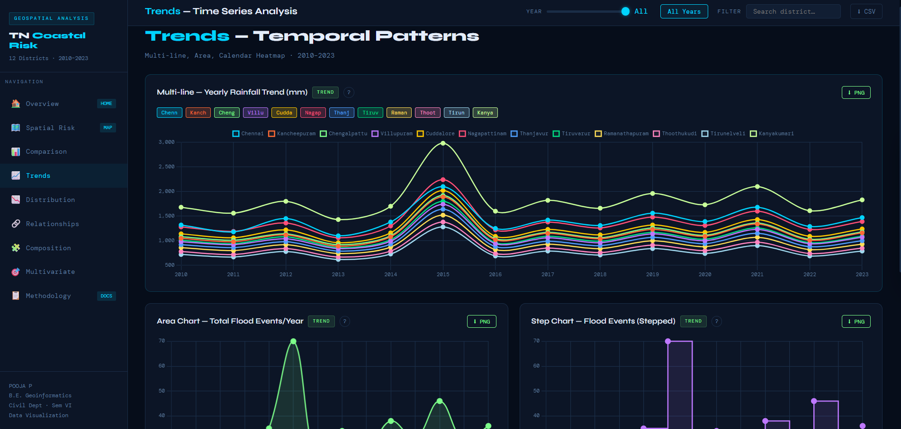
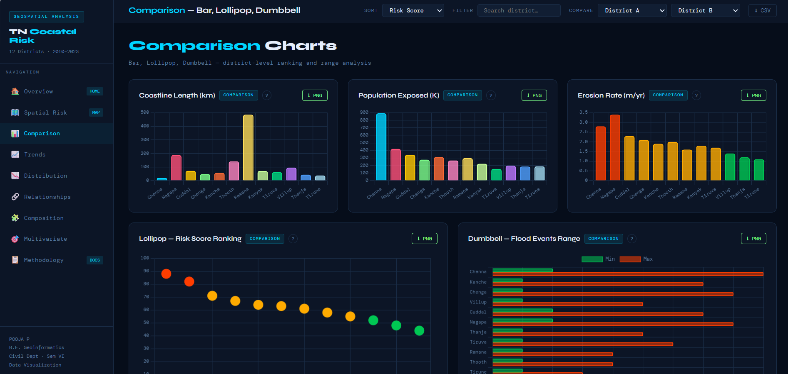
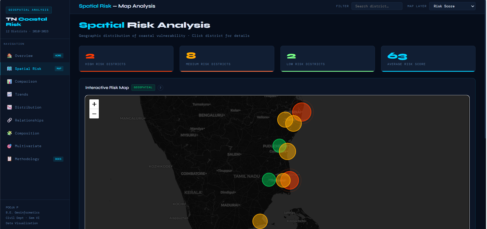

<div align="center">
    <h1> Tamil Nadu Coastal Risk Dashboard🌊</h1>
</div>

<div align="center">


**Multi-variable coastal vulnerability analysis across 12 Tamil Nadu districts (2010–2023).**  
20+ chart types · Interactive Leaflet choropleth · District search & comparison · CSV export

[Overview](#-overview) · [Pages](#-dashboard-pages) · [Dataset](#-dataset) · [Getting Started](#-getting-started) · [Methodology](#-methodology)

</div>

---

## 🔍 Overview

Tamil Nadu's 1,323 km coastline is exposed to chronic erosion, cyclonic flooding, and population pressure. This dashboard integrates six coastal vulnerability variables across 12 districts and 14 years into an interactive multi-page analytical tool — built without any backend or Python dependencies.

**Key findings:**
- Chennai (88) and Nagapattinam (82) carry the highest composite risk scores
- 2015 was a systemic flood year — every district peaked simultaneously (NE monsoon anomaly)
- Ramanathapuram has 486 km of coastline but only risk score 61 — coastline length ≠ risk
- Urbanisation amplifies flood impact: Chennai (72% urban) records the highest flood counts
- Southern districts (Tirunelveli 44, Thanjavur 48) benefit from lower erosion and smaller exposed populations

---

## 📄 Dashboard Pages

| Page | Chart Types | What it Shows |
|---|---|---|
| **Overview** (`index.html`) | Choropleth map · Risk gauges · KPI cards | Composite risk scores, district filter, key findings |
| **Trends** (`trends.html`) | Multi-line · Stacked area · Calendar heatmap | Flood events and rainfall over time (2010–2023) |
| **Comparison** (`comparison.html`) | Bar · Lollipop · Dumbbell | District-by-district variable ranking |
| **Spatial** (`spatial.html`) | Bubble map · Scatter · Heatmap grid | Geographic risk patterns and correlations |
| **Distribution** (`distribution.html`) | Histogram · Box plot · Dot plot | Spread and anomalies per variable |
| **Composition** (`composition.html`) | Stacked bar · Donut · Treemap | Land-use breakdown by district |
| **Relationships** (`relationships.html`) | Scatter matrix · Bubble · Correlation | Variable-to-variable relationships |
| **Multivariate** (`multivariate.html`) | Radar · Parallel coordinates · Heatmap | Multi-factor district profiles |
| **Methodology** (`methodology.html`) | — | Risk formula, data sources, design rationale |

**Total: 20+ distinct visualization techniques across 9 pages.**

---

## 📊 Sample Output



*Overview page — choropleth risk map, district risk gauges, and KPI cards*

| Trends (2010–2023) | District Comparison |
|---|---|
|  |  |


*Spatial page — bubble map encoding composite risk score by district location*

---

## 🗄️ Dataset

Synthetic dataset built on published ranges from INCOIS, IMD, and Census of India.

| Variable | Source Reference | Unit |
|---|---|---|
| Coastline length | NCSCM Coastal District Reports | km |
| Population exposed | Census of India 2011 | thousands |
| Erosion rate | INCOIS Coastal Vulnerability Index | m/year |
| Flood event count | data.gov.in / TNSDMA records | events/year |
| Annual rainfall | IMD District Rainfall Records | mm |
| Land use composition | NCSCM / Bhuvan land cover | % area |

**Coverage:** 12 coastal districts · 2010–2023 · 14 years

**Districts:** Chennai · Kancheepuram · Villupuram · Cuddalore · Nagapattinam · Thiruvarur · Thanjavur · Pudukkottai · Ramanathapuram · Thoothukudi · Tirunelveli · Kanyakumari

---

## 🚀 Getting Started

No installation needed. This is a pure HTML/CSS/JS project.

```bash
# Clone the portfolio
git clone https://github.com/pooja2027/Geospatial_Portfolio.git
cd Geospatial_Portfolio/Coastal_Risk_Dashboard

# Open in browser
start index.html       # Windows
open index.html        # macOS
```

Or just double-click `index.html`.

For the best experience use **Chrome** or **Firefox** — Leaflet maps require a modern browser.

---

## 📐 Methodology

### Risk Score Formula

```
Risk Score = 0.35 × Population + 0.25 × Erosion + 0.20 × Rainfall + 0.20 × Coastline
```

All variables are min-max normalized across the 12 districts before weighting. Final score is scaled 0–100.

| Variable | Weight | Rationale |
|---|---|---|
| Population Exposed | 35% | Human exposure drives real-world impact |
| Erosion Rate | 25% | Structural hazard — long-term physical loss |
| Rainfall | 20% | Flood trigger — annual intensity proxy |
| Coastline Length | 20% | Exposure extent |

### Risk Categories
- 🔴 **High**: Score ≥ 75
- 🟡 **Medium**: Score 55–74
- 🟢 **Low**: Score < 55

### Visualization Design Rationale
Chart types were selected for analytical purpose, not aesthetic variety:
- **Comparison** (bar, lollipop, dumbbell) → district ranking
- **Trend** (multi-line, area, calendar) → temporal patterns
- **Distribution** (histogram, box plot, dot plot) → spread and anomalies
- **Relationship** (scatter, bubble, heatmap) → correlations
- **Composition** (stacked bar, donut, treemap) → land-use differences
- **Multivariate** (radar, parallel coords) → multi-factor profiles

---

## 🛠️ Tech Stack

| Tool | Purpose |
|---|---|
| HTML5 / CSS3 / JS | Core frontend — no framework |
| [Chart.js](https://www.chartjs.org) | 20+ interactive chart types |
| [Leaflet.js](https://leafletjs.com) | Interactive choropleth maps |
| [DM Mono](https://fonts.google.com/specimen/DM+Mono) | Monospace UI font |

---

## 📁 Project Structure

```
Coastal_Risk_Dashboard/
├── index.html              # Overview — choropleth map + risk gauges
├── trends.html             # Temporal flood/rainfall analysis
├── comparison.html         # District-by-district comparison
├── spatial.html            # Spatial risk patterns
├── distribution.html       # Statistical distribution analysis
├── composition.html        # Land-use composition
├── relationships.html      # Variable correlation analysis
├── multivariate.html       # Multi-factor district profiles
├── methodology.html        # Risk formula + data documentation
│
├── css/
│   └── style.css           # Dark theme design system
│
├── js/
│   ├── data.js             # Shared dataset + chart helpers
│   └── nav.js              # Sidebar navigation
│
└── data/
    └── coastal_data.json   # Full district dataset (2010–2023)
```

---

## 🏆 Origin

Built as a **Data Visualization minor project** for the Introduction to Data Visualization course,  
B.E. Geoinformatics Engineering, College of Engineering Guindy, Anna University.

---

## 📄 License

MIT License — see the root [LICENSE](../GeoVista/LICENSE) for details.

---

<div align="center">
Made with 🌊 from Chennai &nbsp;·&nbsp;
Part of <a href="https://github.com/pooja2027/Geospatial_Portfolio">Geospatial_Portfolio</a>
&nbsp;·&nbsp;
<a href="https://github.com/pooja2027">@pooja2027</a>
</div>
