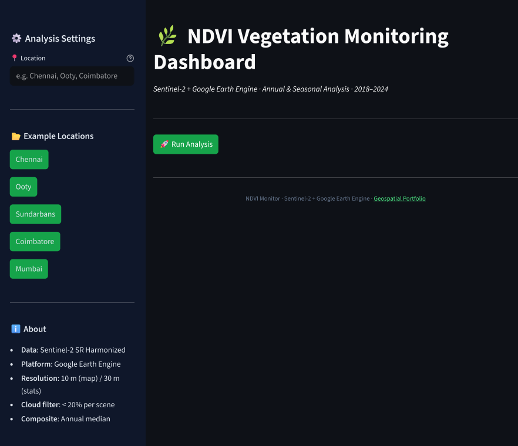
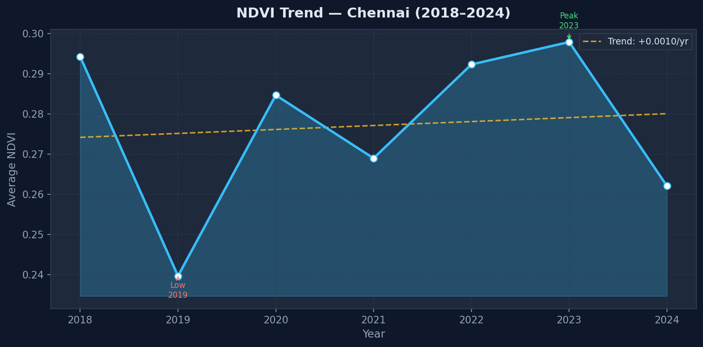
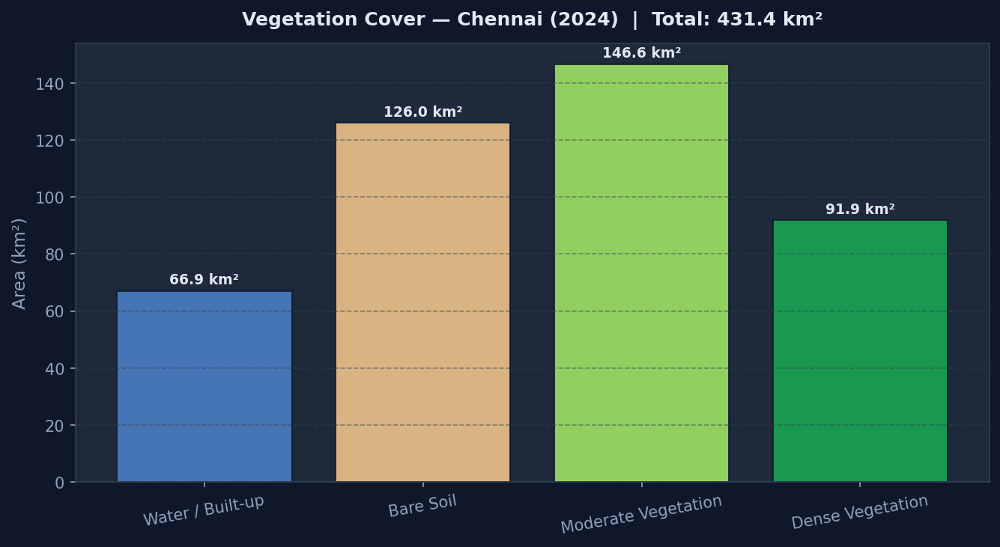
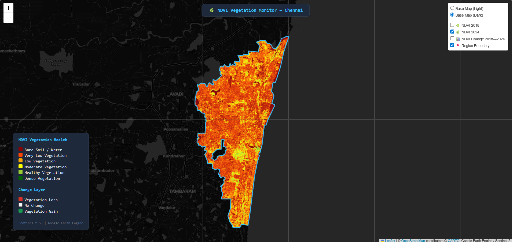

# 🌿 NDVI Vegetation Monitoring — Sentinel-2 + Google Earth Engine

<div align="center">


**Automated NDVI analysis for any location using Sentinel-2 imagery via Google Earth Engine.**  
Computes annual trends, seasonal variation, vegetation classification, and change detection (2018–2024).

[Features](#-features) · [Sample Results](#-sample-results--chennai) · [Getting Started](#-getting-started) · [Structure](#-project-structure) · [Methodology](#-methodology)

</div>

---

## 🔍 Problem

Tracking vegetation health over large regions requires multi-temporal satellite analysis — typically inaccessible without GIS expertise or expensive software. This project automates the full pipeline from a place name to publication-quality outputs using free, open tools.

---

## 💡 Solution

Enter any city or region name. GeoVista NDVI fetches the boundary from OpenStreetMap, pulls Sentinel-2 imagery from Google Earth Engine, and produces:
- Annual NDVI trend (2018–2024) with slope and peak/low annotations
- Seasonal breakdown across all four seasons
- Vegetation classification by area (km²)
- Interactive multi-layer map with change detection overlay
- Structured analysis report with interpretation

---

## ✨ Features

| Feature | Description |
|---|---|
| 🌍 **Any location** | Enter any city, district, or region — boundary auto-fetched from OSM |
| 📅 **Annual trend** | Mean NDVI per year (2018–2024) with linear trend line |
| 🗓️ **Seasonal analysis** | NE Monsoon / Summer / SW Monsoon / Post-Monsoon breakdown |
| 🗺️ **Interactive map** | NDVI 2024, NDVI 2018, and change layer on a multi-layer Folium map |
| 📊 **Vegetation classification** | Area per class: Water/Built-up · Bare Soil · Moderate Veg · Dense Veg |
| 📄 **Auto report** | Structured `.txt` report with health interpretation and methodology |
| 🛰️ **GeoTIFF export** | Batch export to Google Drive via GEE automatically |
| 🏙️ **Example cities** | One-click load: Chennai, Ooty, Coimbatore, Sundarbans, Mumbai |

---

## 📊 Sample Results — Chennai



*Dashboard showing metrics, trend chart, and interactive map for Chennai*

| NDVI Trend (2018–2024) | Vegetation Cover by Class (2024) |
|---|---|
|  |  |


*Interactive map — NDVI 2024 layer with 2018→2024 change overlay. Red zones indicate vegetation loss.*

### Key Findings

| Metric | Value |
|---|---|
| Mean NDVI 2018 | 0.2943 |
| Mean NDVI 2024 | 0.2620 |
| Change | **−10.95%** |
| Peak Year | 2023 |
| Lowest Year | 2019 |
| Interpretation | Significant vegetation loss driven by urban expansion along peri-urban fringe |

---

## 🚀 Getting Started

### Prerequisites
- Python 3.10+
- A [Google Earth Engine](https://earthengine.google.com) account (free for research)
- GEE authenticated once via `earthengine authenticate`

### Installation

```bash
# 1. Clone the portfolio
git clone https://github.com/pooja2027/Geospatial_Portfolio.git
cd Geospatial_Portfolio/NDVI_Analysis

# 2. Create virtual environment
python -m venv .venv
source .venv/bin/activate       # Windows: .venv\Scripts\activate

# 3. Install dependencies
pip install -r requirements.txt

# 4. Authenticate GEE (first time only)
earthengine authenticate

# 5. Create outputs folder
mkdir outputs

# 6. Run the dashboard
streamlit run app.py
```

### CLI usage (no UI)

```bash
python NDVI_Region_Tool.py
# Enter place name: Chennai
```

All outputs save to `outputs/`.

### CSV of custom region

If your region isn't geocodable by name, the tool falls back to a 20 km buffer around the point automatically.

---

## 📁 Project Structure

```
NDVI_Analysis/
├── app.py                        # Streamlit dashboard
├── NDVI_Region_Tool.py           # CLI analysis pipeline
├── requirements.txt
├── .gitignore
│
├── src/
│   ├── __init__.py
│   ├── ndvi_engine.py            # GEE operations: NDVI, time series, seasonal, classification
│   ├── location_utils.py         # Geocoding, OSM boundary, Shapely → ee.Geometry
│   ├── viz_utils.py              # Dark-themed charts + Folium map builder
│   └── report_utils.py           # Structured report with interpretation logic
│
├── outputs/                      # Generated files (gitignored)
│   └── .gitkeep
│
└── docs/
    └── screenshots/
```

---

## 🛠️ Tech Stack

| Tool | Purpose |
|---|---|
| [Google Earth Engine](https://earthengine.google.com) | Sentinel-2 data access and cloud computation |
| [earthengine-api](https://developers.google.com/earth-engine) | Python GEE client |
| [Streamlit](https://streamlit.io) | Interactive web dashboard |
| [Folium](https://python-visualization.github.io/folium/) | Interactive Leaflet.js maps |
| [OSMnx](https://osmnx.readthedocs.io) | OpenStreetMap boundary download |
| [GeoPandas](https://geopandas.org) | Spatial data handling |
| [Matplotlib](https://matplotlib.org) | Chart generation |

---

## 📐 Methodology

```
NDVI = (B8 − B4) / (B8 + B4)
```

| Parameter | Value |
|---|---|
| Sensor | Sentinel-2 MSI Level-2A (SR Harmonized) |
| Cloud filter | < 20% cloud pixel percentage per scene |
| Temporal composite | Annual median (reduces seasonal noise) |
| Statistics scale | 30 m spatial resolution |
| Export scale | 10 m (GeoTIFF to Google Drive) |

**Vegetation classes:**

| Class | NDVI Range |
|---|---|
| Water / Built-up | < 0.1 |
| Bare Soil | 0.1 – 0.2 |
| Moderate Vegetation | 0.2 – 0.4 |
| Dense Vegetation | ≥ 0.4 |

---

## 🧭 Roadmap

- [ ] NDVI anomaly detection (Z-score based alerts)
- [ ] Multi-city comparison mode
- [ ] EVI and SAVI index support
- [ ] Landsat 8/9 integration for pre-2017 history
- [ ] Automated monthly report generation

---

## 📄 License

MIT License — see the root [LICENSE](../GeoVista/LICENSE) for details.

---

<div align="center">
Made with 🌊 from Chennai &nbsp;·&nbsp;
Part of <a href="https://github.com/pooja2027/Geospatial_Portfolio">Geospatial_Portfolio</a>
&nbsp;·&nbsp;
<a href="https://github.com/pooja2027">@pooja2027</a>
</div>